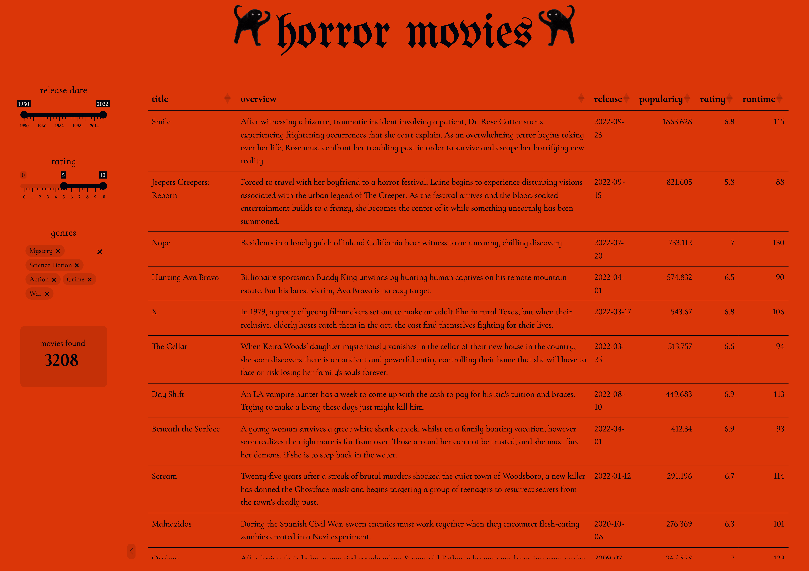

# Horror Movies

[Check it out!](https://almita.shinyapps.io/horrormovies/)

This Shiny app is based on Tidy Tuesday's [horror movie dataset](https://github.com/rfordatascience/tidytuesday/tree/699475d3225715dc735bd0cb24e0caa85a4b5fd9/data/2022/2022-11-01), it includes movies dating back to the 1950's. It features a sortable table that can be filtered by release date, ratings and genres. The dataset contains \~35k movies, so it can be a bit slow to load, especially if the ranges and the number of genres selected are big.
